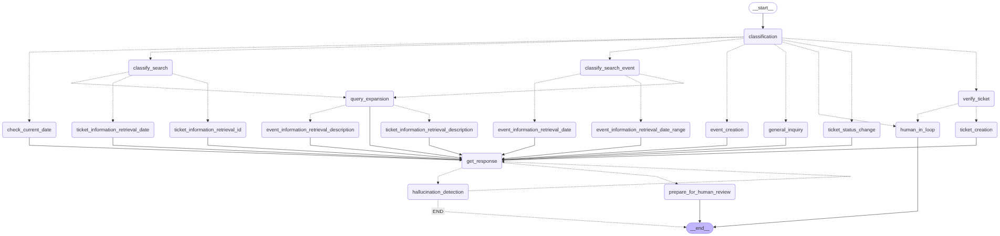

# Smart Customer Service RAG Assistant

A sophisticated, conversational AI assistant for customer service and service desk tasks, built with advanced RAG (Retrieval-Augmented Generation) architecture and agentic workflows.



## 🌟 Overview

This project implements an intelligent customer service assistant that combines the power of large language models with a robust retrieval system. The assistant can understand user intent, interact with knowledge bases, manage support tickets, schedule events, and perform self-correction to provide accurate and relevant responses.

## 🚀 Key Features

### **Conversational AI**
- Natural language interface for seamless user interaction
- Context-aware conversations with memory retention
- Personalized responses based on conversation history

### **RAG Architecture**
- Grounds responses in factual data from multiple sources
- Retrieves relevant information from tickets, product info, policies, and calendar
- Uses FAISS vector store for efficient similarity search

### **Agentic Workflow with LangGraph**
- State-driven workflow managed by LangGraph
- Intelligent routing through various stages
- Complex multi-step reasoning capabilities

### **Multi-Tool Capability**
- **Ticket Management**: Create, update, and query support tickets
- **Calendar Management**: Schedule events and find available time slots
- **Knowledge Retrieval**: Search through documentation and policies

### **Self-Correction & Refinement**
- **Query Expansion**: Rewrites queries to improve search recall
- **Input Validation**: Verifies ticket creation requests
- **Hallucination Detection**: Ensures response relevance and accuracy
- **Conflict Resolution**: Detects scheduling conflicts and suggests alternatives

## 🏛️ Architecture & Workflow

The assistant's logic is orchestrated by a LangGraph state machine that defines possible states and transitions, enabling complex, multi-step reasoning and robust self-correction loops.

### Typical Workflow:
1. **Human Input**: Process user queries
2. **Intent Classification**: Categorize user intent (ticket_creation, event_information_retrieval, etc.)
3. **Conditional Routing**: Route requests to appropriate processing paths
4. **Agent & Tool Execution**: Execute relevant tools using autonomous agent
5. **Response Generation**: Formulate initial answers
6. **Hallucination Detection**: Validate generated answers
7. **Final Answer**: Present verified responses to users

## 🛠️ Core Components

### 1. RAGDocStore
Manages the knowledge base with separate FAISS vector stores:
- `ticket_store`: Support tickets
- `calendar_store`: Scheduled events  
- `policy_store`: Company policies
- `information_store`: Product data and general information

### 2. Tools
- **TicketTool**: Create, update, and query tickets
- **CalendarTool**: Schedule events and manage calendar conflicts
- **Knowledge Tools**: Search through documentation and policies

### 3. LangGraph State Machine
Central controller with nodes (functions) and edges (flow direction) that provides:
- Advanced reasoning capabilities
- Intelligent routing
- Self-correction loops

## ⚙️ Getting Started

### Prerequisites
- Python 3.9+
- Google AI API key (for Gemini model)

### Installation

1. **Clone the repository**
   ```bash
   git clone <repository-url>
   cd <repository-directory>
   ```

2. **Install dependencies**
   ```bash
   pip install -r requirements.txt
   ```

### Required Dependencies
```txt
langchain
langgraph
langchain-google-genai
langchain-openai
langchain-community
faiss-cpu
sentence-transformers
numpy
python-dateutil
ipython
warnings
```

### Configuration

#### API Key Setup
**⚠️ Important**: Replace the placeholder API key with your actual Google AI API key.

```python
# Recommended approach - use environment variables
import os
google_api_key = os.environ.get("GOOGLE_API_KEY")

model = ChatGoogleGenerativeAI(
    model=model_name2,
    google_api_key=google_api_key,
    # ...
)
```

#### Data Files
The application automatically creates a `data/` directory with necessary files:
- `data/tickets.txt`: Support tickets storage
- `data/calendar.txt`: Calendar events storage
- `data/policies.txt`: Company policy documents
- `data/product_data.txt`: Product information

You can pre-populate these files with your own data to enhance the assistant's knowledge base.

## 🚀 Running the Assistant

1. Open `smart_customer_service_rag_assistant_rt_MAIN.ipynb` in Jupyter
2. Run all cells from top to bottom
3. The final cell executes `run_llm()` to start the interactive interface
4. Type queries when prompted with `>`
5. Exit by typing `quit`, `exit`, or `q`

## 💡 Usage Example

```
SCSR Assistant
----------------------------
> hello my name bob, what day is today?
Processing your request...

> Entering new AgentExecutor chain...
The user is asking for today's date. I should use the CheckCurrentDate tool to get this information.
Action: CheckCurrentDate
Action Input: _=''
Observation: 2025-07-05
Thought: I have successfully retrieved today's date.
Final Answer: Today's date is 2025-07-05.

> Finished chain.
Today's date is 2025-07-05.

> what is my name?
Processing your request...

> Entering new AgentExecutor chain...
The user is asking for their name. The previous turn established that their name is Bob. I can directly answer this question.
Final Answer: Your name is Bob.

> Finished chain.
Your name is Bob.

> quit
Processing your request...
Thank you for using SCSR Assistant. Goodbye!
```

## 🔧 Key Capabilities

- **Intelligent Ticket Management**: Create, update, and search support tickets
- **Smart Calendar Integration**: Schedule events with conflict detection
- **Knowledge Base Search**: Query policies, documentation, and product information
- **Conversational Memory**: Maintain context across multiple interactions
- **Self-Validation**: Detect and correct potential response errors
- **Multi-Modal Search**: Search by ID, date, description, or keywords

## 🤝 Contributing

Contributions are welcome! Please feel free to submit issues, feature requests, or pull requests.

## 📄 License

[Add your license information here]

## 🙏 Acknowledgments

- Built with [LangChain](https://langchain.com/) and [LangGraph](https://langgraph.com/)
- Powered by Google's Gemini AI model
- Vector search capabilities provided by FAISS

---

*For questions or support, please open an issue in the repository.*
